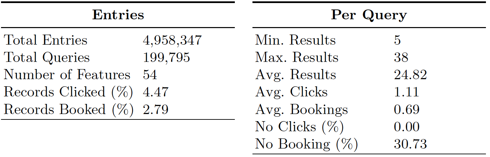
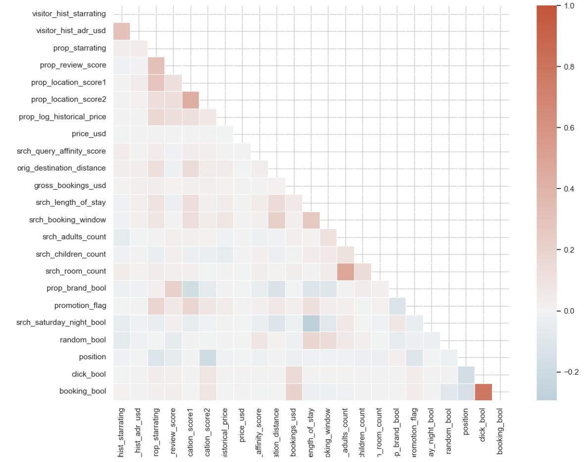
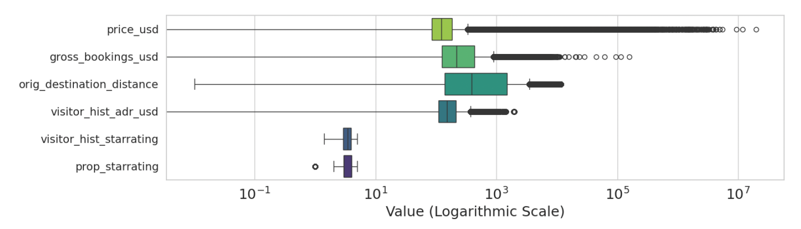
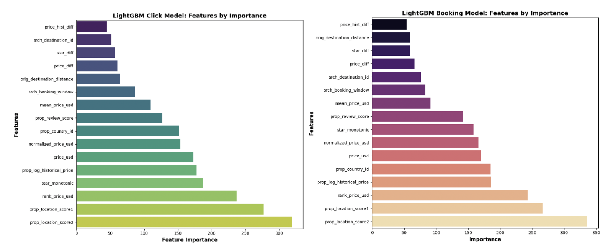
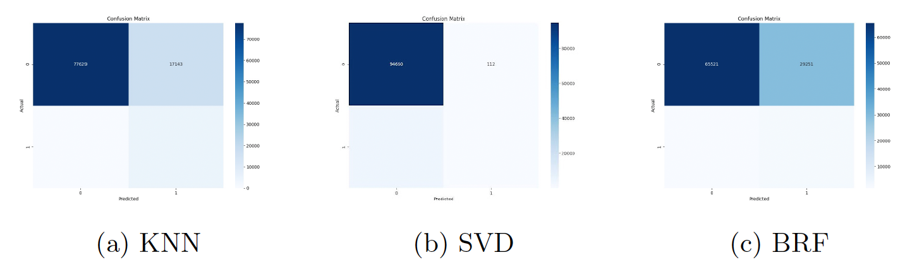
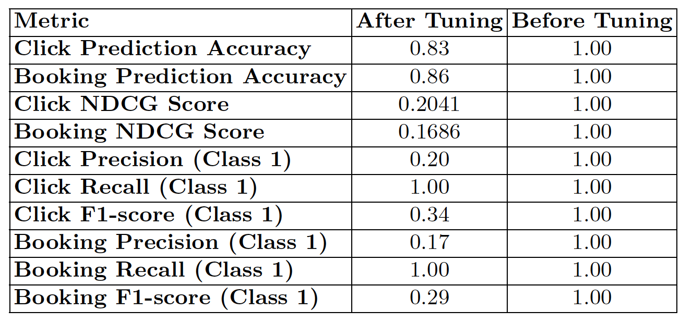
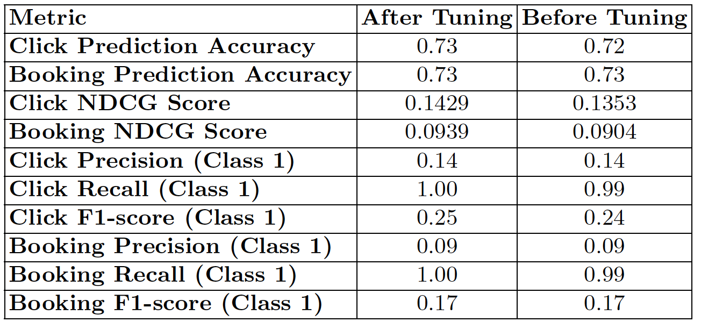
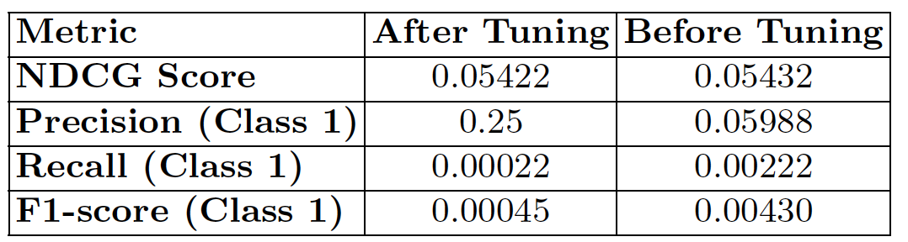

# Hotel Ranking Optimization for Expedia
This project applies machine learning models to optimize hotel rankings for Expedia search results with the aim of maximizing bookings. After extensive data cleaning and feature engineering, LambdaMART (using LightGBM) was identified as the best-performing model.

---

## 📁 Project Structure

| File/Folder              | Description                                      |
|--------------------------|--------------------------------------------------|
| `expedia_hotel_ranking.ipynb` | Analysis and modeling notebook           |
| `requirements.txt`       | List of python packages needed                   |
| `images/`                | Visualizations of results              |

---

## 🚀 Getting Started

### Clone the repository

```bash
git clone https://github.com/ES870/expedia-hotel-ranking.git
```

### Install required packages
```bash
pip install -r requirements.txt
```

### Run the notebook
```bash
jupyter notebook
```

---

## 🧠 Methods & Techniques

- Data preprocessing and feature engineering
- Handling class imbalance with SMOTE
- LambdaMART with LightGBM
- Evaluation using NDCG@5 metric

---

## ✅ Results
- Achieved a strong ranking model based on competitive NDCG@5 scores.
- Identified key predictive features like hotel location scores and price competitiveness.

---

## 📊 Key Visuals

### 📋 Dataset Overview

  
*Table 1: Summary of the Expedia hotel dataset including total samples, number of features, and class distribution for bookings and clicks.*

---

### 🧮 Correlation Analysis

  
*Figure 2: Correlation heatmap showing weak linear relationships among most features, motivating the use of non-linear models.*

---

### 🧪 Feature Distributions

  
*Figure 4: Box plots for key numerical features highlighting outliers and skewness, which were addressed during preprocessing.*

---

### 🔍 Feature Importance

  
*Figure 5: Feature importance scores from the LambdaMART model, identifying which attributes most influence hotel booking predictions.*

---

### 📉 Model Confusion Matrices

  
*Figure 6: Confusion matrices showing prediction performance of KNN, SVD, and Balanced Random Forest classifiers.*

---

### ⚙️ Model Performance Before & After Tuning

#### 🔹 K-Nearest Neighbors (KNN)

  
*Table 7: Comparison of KNN model performance before and after hyperparameter tuning, showing modest improvements in accuracy and F1-score.*

---

#### 🔹 Singular Value Decomposition (SVD)

  
*Table 8: SVD model results showing improved precision and recall after tuning, especially in click prediction.*

---

#### 🔹 Balanced Random Forest (BRF)

  
*Table 9: BRF model performance gains after tuning, with notable increases in recall and F1-score — particularly effective for handling class imbalance.*

---
## 📬 Contact
For questions or collaboration, feel free to reach out via [my homepage](https://estock2.wixsite.com/evastock/portfolio).


